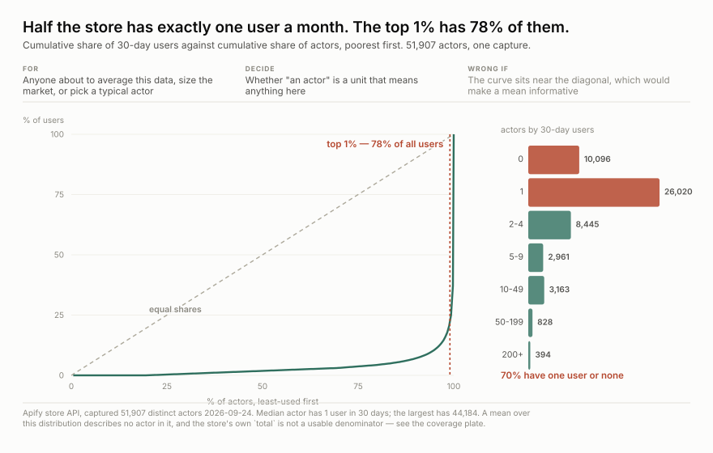
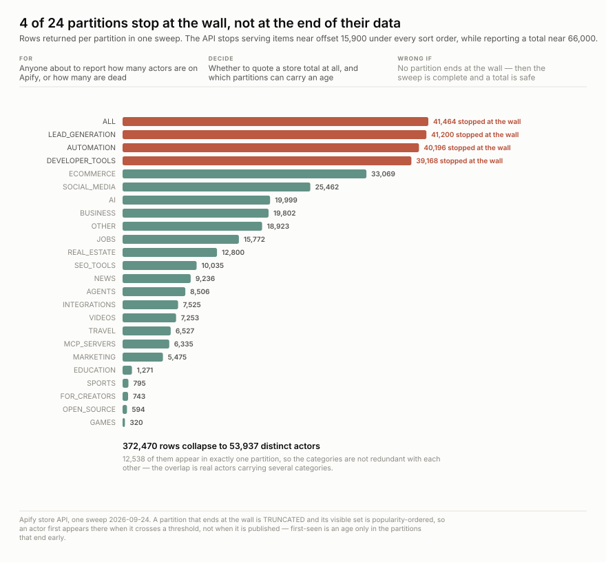
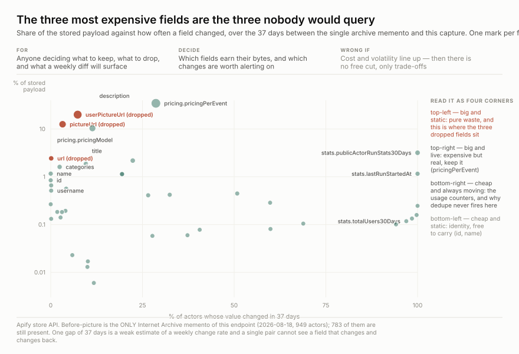

<h1 align="center">wss-apify</h1>

<p align="center">
  <strong>Which scrapers people actually pay to run, captured weekly</strong>
</p>

<div align="center">

  <a href="https://github.com/q3dresearch/wss-apify/actions/workflows/capture.yml"></a>
  <a href="https://github.com/q3dresearch/wss-apify/commits"></a>
  <a href="https://github.com/q3dresearch/wss-apify/blob/main/LICENSE"></a>
  <a href="https://github.com/q3dresearch/wss-apify"></a>

</div>

<p align="center">
  <sub>fleet: <a href="https://github.com/q3dresearch/wss-engine">engine</a> · <a href="https://github.com/q3dresearch/wss-hugging-face">hugging face</a> · <a href="https://github.com/q3dresearch/wss-openrouter">openrouter</a> · <strong>apify</strong> · <a href="https://github.com/q3dresearch/wss-cloud-footprint">cloud footprint</a> · <a href="https://github.com/q3dresearch/wss-flood-warnings">flood warnings</a></sub>
</p>

`totalUsers30Days` is live paid demand per scraper — how many people ran this
thing last month. The store publishes only **now**: no history endpoint, no
changelog, no creation date in the listing, and no status meaning withdrawn. An
actor that is unpublished simply stops being returned. So both ends of its life,
arrival and departure, exist only as a difference between two captures.



**There is no typical actor.** The median has **one** user in 30 days and the
largest has 44,184; the top 1% holds **78%** of all users and **70% have one user
or none**. A mean over this distribution describes nothing in it.

**Every source, its live URL, its licence and its last stored capture is listed in
[SOURCES.md](SOURCES.md)** — generated by `wss sources`, so it cannot drift from
the registry.

## Questions this exists to answer

A source that answers no question gets dropped. A question nothing answers is the
next thing to build.

| # | Question | Status |
| --- | --- | --- |
| Q1 | Which scrapers have real users, as opposed to merely existing? | **answered** — see the chart above |
| Q2 | What share of the store is dead? | **answered as a floor** — 19.4% have zero 30-day users, and the reachable slice is popularity-ordered, so the true rate is higher |
| Q3 | When an actor disappears, was its usage already falling — or did it vanish healthy? | needs 2+ captures. This is the whole reason for capturing |
| Q4 | Do actors that arrive together survive together? | needs ~1 year — the store carries no `createdAt`, so age accrues only from our own first-seen |
| Q5 | Do price changes precede usage changes? | accruing — `pricingPerEvent` is 34.6% of the payload and was kept **for this question alone** |
| Q6 | Is the store growing, or churning at a constant size? | needs 4+ captures, counted on distinct ids — `total` is not a denominator |
| Q7 | Does a crowded category predict failure — does a land rush end in a shakeout? | open |

## What you can build

Figures come from [`examples/`](examples) —
stdlib only, deterministic, no network at draw time.
**[examples/data-shape.md](examples/data-shape.md) is the place to start**: the
three figures plus the seven traps in this data, each with its number.



**The sweep is partial and knows which parts.** 123,400 rows collapse to 51,907
distinct actors; 14,473 appear in exactly one partition, so the overlap is real
actors carrying several categories rather than redundant fetching.



**Cost and volatility are independent, which is what made a 48% cut free.**

## Using it

Reading this data needs nothing — no key, no account, not even a clone:

```bash
B=https://raw.githubusercontent.com/q3dresearch/wss-apify/main/derived/observations
duckdb -c "SELECT * FROM read_csv_auto('$B/2026-09.csv.gz') LIMIT 5"
```

```bash
python examples/load_observations.py     # sqlite + the queries in queries.sql
python examples/cron_report.py           # did the cron fire, on time, every time
python examples/store_stats.py --out stats.json   # from the repo root
```

Columns are `series_id, entity_id, observed_at, captured_at, metric, value, unit,
source_id, raw_ref, parser_version`, where `entity_id` is the Apify actor id.
Metrics: `users_7d`, `users_30d`, `users_90d`, `users_total`, `runs_total`,
`builds_total`, `pricing_model`, `categories`, `review_count`, `review_rating`,
`bookmark_count`, `last_run_started_at`, `source_partition`, and `listed` — whose
**absence** in a later capture is the departure signal.

One capture is 160 endpoints → **51,907 distinct actors** → ~2.1M observations,
35 MB of raw.

## Why weekly, when monthly was the first answer

Two reasons, both measured.

**First-seen is the only age signal, and its resolution is the cadence.** With no
`createdAt` in the listing, the age proxy is the first capture an actor appears
in — so everything arriving between two captures shares one birthday. The actors
that matter are young: a stratified sample put the **1–9 monthly-user band at a
median age of 104 days** and the **zero-user band at 323**, and in one six-actor
niche the newest competitor was **nine days old**. Monthly would collapse those
six entries into five points and erase the order they arrived in — which is the
only thing separating a land rush from a steady trickle.

**`totalUsers7Days` is a seven-day window.** Weekly sampling of it is
non-overlapping and independent. Monthly discards three weeks in four.

**What weekly does not buy.** `totalUsers30Days` is a 30-day *rolling* window, so
four weekly reads share about 75% of their input — the usage series carries
roughly one independent observation per month however often it is sampled, and
`totalUsers90Days` is worse. Weekly sharpens **arrival and departure**. It does
not sharpen usage.

**Storage, and the 48% that was free.** A capture was **67.1 MB** until three fields
came out of the stored bytes:

| dropped field | share of payload | why it costs nothing |
| --- | ---: | --- |
| `userPictureUrl` | 20.1% | CDN link to the developer's avatar |
| `pictureUrl` | 12.7% | CDN link to the actor's icon |
| `url` | 2.4% | exactly `lowercase("https://apify.com/" + username + "/" + name)` on **123,639 of 123,639** records checked |

That is `project_drop` in the registry (engine v0.6.57, opt-in, off everywhere else).
`content_sha256` still records the hash of the **untouched** response and every projected
row carries `projected:...` in `warnings`, so the edit is visible and reversible by
refetching. Result: **35.0 MB per capture — 1.82 GB/yr weekly, 12.8 GB/yr daily.**

**What was deliberately NOT dropped.** `currentPricingInfo.pricingPerEvent` is the single
largest field at 34.5% and changed on 29.1% of actors over a 37-day window — expensive
*and* live. Dropping it would keep "a price changed, when and why" while losing the price
*levels*, which is a real loss rather than a free one. `description` (10.4%) is how an
actor says what it does. Both stay.

**There is no way to fetch less** — `fields`, `select`, `projection`, `desc=false`,
`includePricing=false`, `minimal=true` and `view=compact` are each silently ignored and
return byte-identical output. And the 2.16x partition overlap is inherent, because actors
genuinely carry several categories.

The one droppable block is the `ALL` partition: 16 of 160 pages, uniquely contributing
**431 actors of 51,449 (0.8%)**. It is kept, because those are the *uncategorised*
actors and nothing else would ever see them — 10% of cost for a permanent blind spot is
the wrong trade in a repo whose whole premise is that capture is irreversible.

## The daily trial window

**Weekly is the intent. Daily is the trial.** The registry declares `cadence: weekly`
and the workflow's `CADENCE` says weekly — those two must agree or `wss plan` returns
`[]` and the job goes green having captured nothing. What is temporarily daily is only
the **cron**: how often the runner wakes up.

It is daily **until 2026-10-24** because GitHub's scheduler fails in three ways that all
look like success from inside a single run:

- it **delays** a job, minutes to hours, worst on the hour — which is why this cron is at `:35`
- it **drops** a firing entirely under load, leaving no trace anywhere
- it **disables** scheduled workflows outright after 60 days of repository inactivity

A weekly job takes a month to reveal any of that. Daily gives an answer in days, at a
cost of about **1.05 GB for the trial month**.

**The workflow enforces its own deadline.** Past `REVERT_AFTER` every run emits a warning
annotation in the Actions UI until the cron is changed back to `35 3 * * 1`. It warns
rather than fails, because a missed capture here is irreversible and a noisy one is not.
A temporary cron becomes a permanent one the moment it stops being mentioned.

**Reading the result:** `python3 examples/cron_report.py` replays every committed version
of `state/last_run.json` out of git history — the file is overwritten each run, so the
history *is* the record. It reports delivery rate, gap distribution, and any gap over 36
hours, which on a daily cron means a night was skipped and **no capture exists for it**.
The heartbeat records `event` too, so a manual `workflow_dispatch` cannot be mistaken for
the cron working.

## Three fields that look like measurements and are not

| field | what it actually is |
| --- | --- |
| `count` | **echoes the requested `limit`.** A page returning zero items still reports `count: 1000` |
| `limit` | a **maximum**. Mid-range pages return 384–959 for `limit=1000`, so a short page is not the end |
| `total` | **not a denominator.** 66,631 / 73,016 / 70,918 for three sort orders in the same minute, and it drifts upward *during* a sweep because the store is written while it is read |

Only `len(items)` means anything, and only a **zero-item page** ends a partition.
Reading `count` produced two confident and opposite wrong claims about the
store's size within minutes.

## The truncation, and the trap it sets

The endpoint stops returning items near **offset 15,900** under every sort order,
while claiming a total near 66,000. A naive sweep collects about a quarter of the
store and reports success — so the sweep is **partitioned by category**, each
partition getting its own offset budget
([examples/refresh_endpoints.py](examples/refresh_endpoints.py)).

**This is also why first-seen has to be read carefully.** Inside a partition that
truncates, the visible set is popularity-ordered, so an actor first appears when
it grows popular enough to *cross the threshold* — not when it was published.
Those are different events.

| partitions | claimed size | enumerate fully? | is first-seen an age? |
| --- | ---: | --- | --- |
| 20 smaller categories | ≤ ~14,000 | yes | **yes** |
| `AUTOMATION` | ~29,700 | no | no — threshold-crossing |
| `LEAD_GENERATION` | ~24,200 | no | no — threshold-crossing |
| `DEVELOPER_TOOLS` | ~21,700 | no | no — threshold-crossing |

Every observation carries `source_partition` so this distinction survives into
the derived data instead of being lost at capture time. Age analysis is sound in
the small categories and unsound in the three largest.

## Reading the numbers

**A near-zero actor only means failure if it is old.** `totalUsers` is cumulative
and therefore fully confounded with age. Six actors in one niche all showing 2–8
users looked like a graveyard and were in fact all created within five months,
the newest nine days before being read — a land rush, which reads as a demand
signal rather than a death signal.

## Licence

**Crawling is explicitly permitted** — `api.apify.com/robots.txt` states no rules
at all, and `apify.com` carries `Content-Signal: search=yes, ai-input=yes,
ai-train=yes` with `Allow: /`. **Reuse is a separate and unestablished question:**
no licence appears in the payload and the terms have not been read. See
[LICENSE-DATA](LICENSE-DATA), which also covers the `parties_only` personal-data
declaration.

## Layout

| path | what |
| --- | --- |
| `registry/apify.store.actors.yml` | the source definition, gates, and the reasoning |
| `examples/refresh_endpoints.py` | materialises the partitioned endpoint list before validate |
| `parsers/apifyactor_v1.py` | schema `apifyactor.v1` → observations, keyed on actor `id` |
| `raw/`, `manifest/` | captured bytes and the append-only capture log |
| `examples/queries.sql` | arrivals, departures, the dead-bet rate with age, coverage |
| `examples/cron_report.py` | did the cron fire, on time, every time — replayed from git history |
| `examples/data-shape.md` | **start here** — what one capture looks like and the seven traps in it |
| `examples/artifacts/` | three figures and the scripts that build them |
