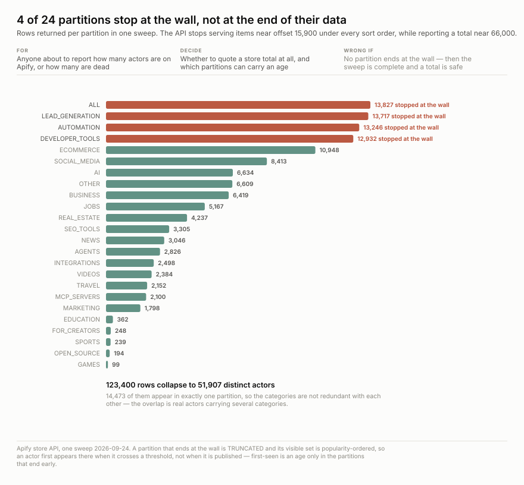
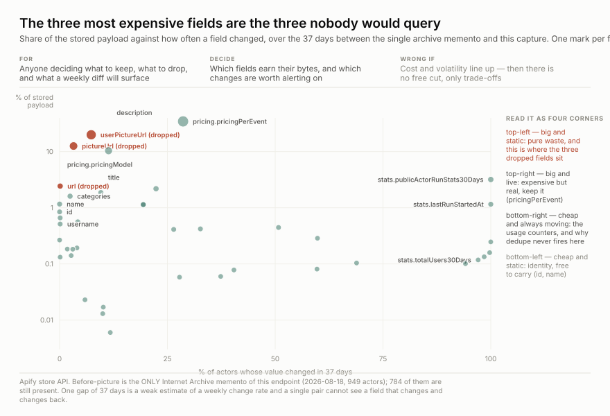

# What one capture looks like, and what will bite you

*Written for whoever queries this data next — including me in six months.*

One weekly capture is **160 pages → 51,907 distinct actors → ~2.1M observations**,
35 MB of raw. Three figures below, then the traps. Every number here came from
`artifacts/scripts/store_stats.py` against the committed captures; nothing is quoted
from memory.

---

## 1. The distribution is a cliff, and it has no typical member


**Median actor: 1 user in 30 days. Largest: 44,184. Top 1% holds 78% of all users.**
26,020 actors have exactly one user and 10,096 have none — **70% have one or zero**.

*What this costs you:* a mean over this distribution describes no actor in it. "Average
users per actor" is arithmetic, not a fact. Report medians and shares of a named base, or
report the head and the tail separately — see `isolate-the-tail-as-its-own-study`.

## 2. The sweep is partial, and it knows which parts



The API stops serving items near **offset 15,900** under every sort order while reporting
a total near 66,000. So the sweep is partitioned by category — and **4 of 24 partitions
still end at the wall**: `ALL`, `LEAD_GENERATION`, `AUTOMATION`, `DEVELOPER_TOOLS`.

*What this costs you:* inside a truncated partition the visible set is popularity-ordered,
so an actor first appears when it **crosses a threshold**, not when it is published.
**First-seen is an age only in the 20 partitions that end early.** Every observation
carries `source_partition` so you can filter; if you don't, your cohort analysis silently
mixes two different events.

## 3. What is worth storing is not what is worth watching



Read it as four corners. **Top-left is pure waste** — big and static — and that is exactly
where the three dropped fields sat (`userPictureUrl` 20.0% of payload / 7.3% changed,
`pictureUrl` 12.6% / 3.2%, `url` 2.4% / 0.1%). **Top-right is expensive and real**:
`pricingPerEvent` is 34.6% of the payload and moved on 28.6% of actors in 37 days, which
is why it was kept. **Bottom-right is the usage counters** — cheap and always moving.

---

## The traps, each with its number

**`total` is not a denominator.** 66,631 / 73,016 / 70,918 for three sort orders in the
same minute, and it drifts upward *during* a sweep because the store is written while it
is read. Report distinct ids collected and say the true size is unknown.

**`count` is not a count.** It echoes the requested `limit`. A page returning zero items
still reports `count: 1000`. Reading it produced two confident and opposite wrong claims
about the store's size within minutes. Only `len(items)` means anything.

**`limit` is a maximum.** Mid-range pages return 384–959 for `limit=1000`. A short page is
not the end of a partition; only a zero-item page is.

**Dedupe will never fire on this source.** `stats.totalRuns`, `stats.totalUsers`,
`stats.lastRunStartedAt` and `stats.publicActorRunStats30Days` changed on **100%** of
overlapping actors over 37 days; `totalUsers30Days` on 97.1%. Every capture is a new
object. Do not expect `outcome: unchanged` and do not size storage as if you will get it.

**Three fields exist twice and disagree.** `actorReviewRating`, `actorReviewCount` and
`bookmarkCount` appear both at top level and inside `stats`, and the two copies differ on
**7.6% / 6.5% / 6.9%** of the 51,907 actors respectively — 3,943, 3,390 and 3,606 records.
They look like duplicates. They are not. Pick one and say which.

**Low usage is confounded with age.** `totalUsers` is cumulative, so it cannot be read
without a creation date — and the store listing carries none. Six actors in one niche all
showing 2–8 users looked like a graveyard and turned out to have been created within five
months, the newest nine days before being read. That is a land rush, which reads as a
demand signal rather than a death signal. **Near-zero only means failed if the actor is
old**, and age here accrues from our own first-seen, forward only.

**`users_30d` is a rolling window.** Four weekly captures share ~75% of their input, so
the usage series carries roughly one independent observation per month however often it
is sampled. `users_7d` is the one that is non-overlapping at weekly cadence.

## What the first month will and will not tell you

It **will** tell you whether the cron is reliable — run
[`cron_report.py`](cron_report.py), which replays `state/last_run.json` out of git history
and flags any gap over 36 hours as a skipped night.

It **will not** tell you anything about age. First-seen only starts accruing from the
first capture, so nothing already in the store can be cohorted for roughly a year. That is
the wss case stated exactly: what the publisher will not give cheaply, we manufacture by
showing up repeatedly.

## Rebuilding these

```
python3 examples/artifacts/scripts/store_stats.py --out stats.json   # from the repo root
python3 examples/artifacts/scripts/chart-usage-concentration.py stats.json
python3 examples/artifacts/scripts/chart-partition-coverage.py stats.json
python3 examples/artifacts/scripts/chart-field-volatility.py stats.json
```

`store_stats.py` must run from the **repo root** — `raw_ref` paths in the manifest are
repo-relative. Volatility is measured against the single Internet Archive memento of this
endpoint (2026-08-18, 949 actors) versus a **live unprojected refetch**, not against this
repo's own captures: those have `project_drop` applied, and comparing a full record to a
deliberately trimmed one measures the trim rather than the publisher.
